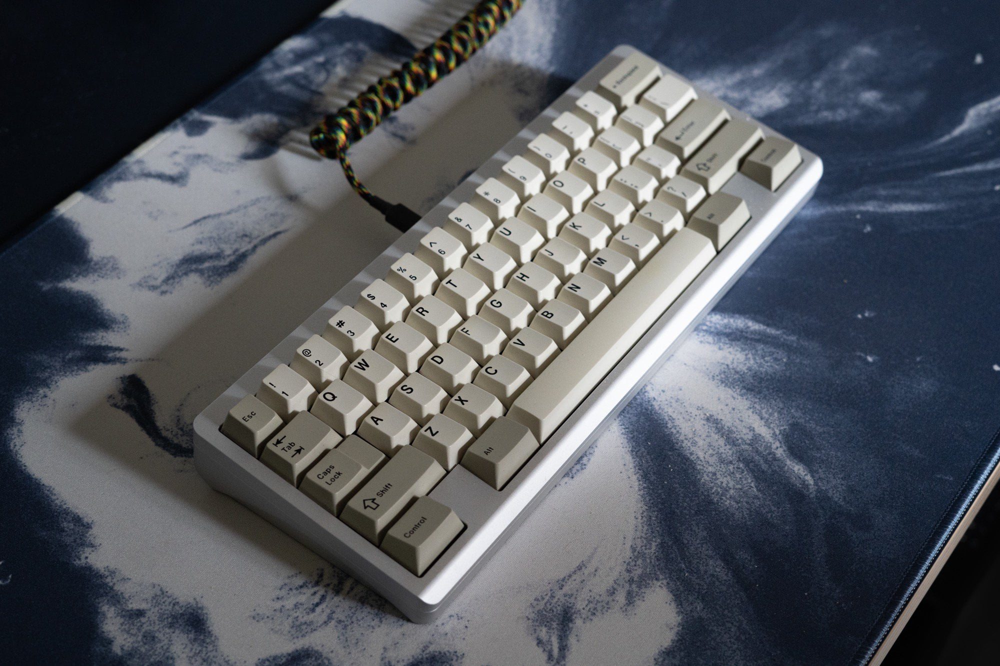

# Hand Engineering 959 Mini

[![CC BY-NC-SA 4.0][cc-by-nc-sa-shield]][cc-by-nc-sa]

The Hand Engineering 959 Mini is an open-source keyboard designed to capture the brilliant industrial aesthetic of the Porsche 959 while staying true to the iconic simplicity of keyboard designers before us. This 60% keyboard features an innovative mounting system and is compatible with QMK and VIA for ultimate customization.

## Features

- **Layout:** 60% WKL (Winkeyless) or WK (Standard)
- **Typing Angle:** 7 degrees
- **PCB:** H60 by Hineybush
- **Firmware:** QMK and VIA compatible
- **Mounting Options:**
  - "O-ring gummy" mount (inspired by the OTD 356mini)
  - Top mount
- **Color Options:**
  - 959 Mini: Silver
  - 959 Mini GT: Hard anodised black with polished stainless steel weight

## Technical Specifications

- PCB: H60 by Hineybush (or any compatible 60% PCB)
- Firmware: QMK and VIA compatible
- Mounting: O-ring gummy mount or top mount
- Angle: 7-degree typing angle

## Firmware

This keyboard is compatible with QMK and VIA. For more information on how to customize your firmware:

- [QMK Documentation](https://docs.qmk.fm/)
- [VIA Website](https://caniusevia.com/)

## Contributing

We welcome contributions to the Hand Engineering 959 Mini project! If you have suggestions for improvements or have found a bug, please open an issue or submit a pull request.

## License

This work is licensed under a
[Creative Commons Attribution-NonCommercial-ShareAlike 4.0 International License][cc-by-nc-sa].

[![CC BY-NC-SA 4.0][cc-by-nc-sa-image]][cc-by-nc-sa]

## Acknowledgments

Special thanks to Max, James, Koen, Flying, Dale and others for their inspiration and contributions to this project.

## About Hand Engineering

Founded in 2019, Hand Engineering is a product design studio based in Ramsgate, UK . Our mission is to create premium mechanical keyboards, tools and accessories for every creative setup.

---

README last updated: [27/09/24]

[cc-by-nc-sa]: http://creativecommons.org/licenses/by-nc-sa/4.0/
[cc-by-nc-sa-image]: https://licensebuttons.net/l/by-nc-sa/4.0/88x31.png
[cc-by-nc-sa-shield]: https://img.shields.io/badge/License-CC%20BY--NC--SA%204.0-lightgrey.svg

